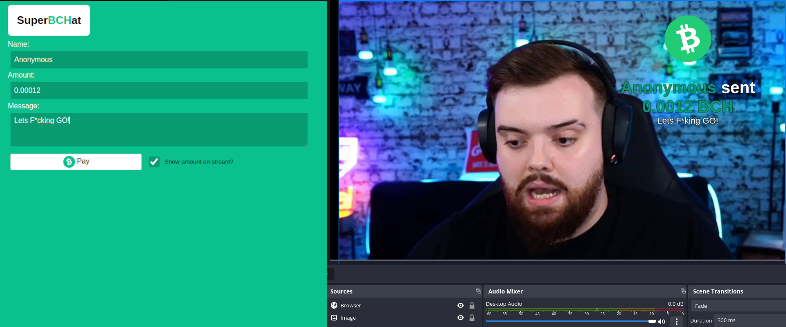

# Superbchat

- Noncustodial and minimalist Bitcoin Cash (BCH) superchat system written in Go.
- Provides an admin view page to see donations with corresponding comments.
- Provides notification methods usable in OBS with an HTML page.

# License

GPLv3

### Donate

sir,thank you
`bitcoincash:qzq6e8hmn6f3u2hu2t3l5kgrd5vjlx0epgpvmnmy7j`
